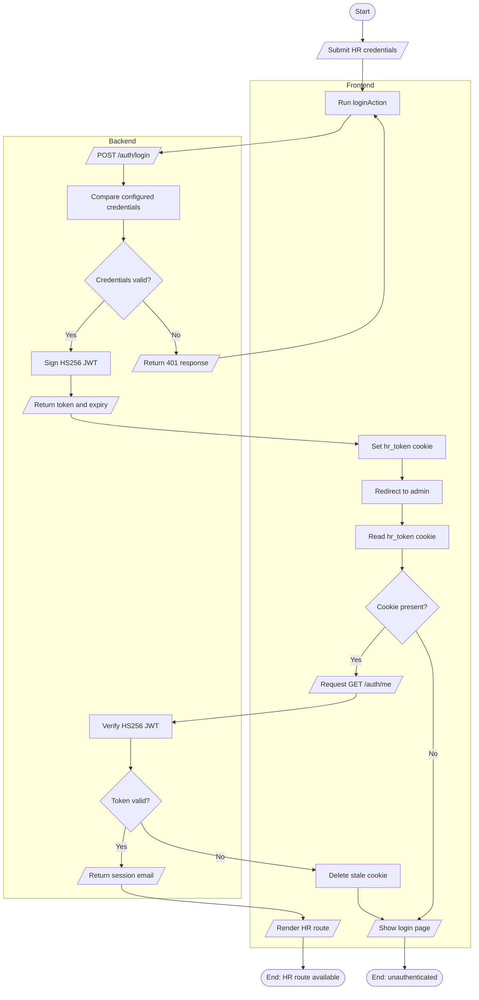
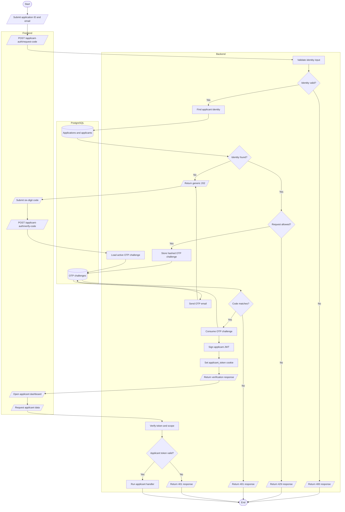

# Authentication Flows

This repository has separate HR and applicant authentication systems. Both issue signed JWTs in HTTP-only cookies, but HR credentials come from configuration while applicants prove access with an emailed one-time code.

## Flowchart

### HR authentication and route guard

### Applicant OTP authentication and protected API access

## Flow

1. The HR login form submits credentials to the Next.js `loginAction`, which calls the backend directly. The backend compares them with `HR_EMAIL` and `HR_PASSWORD`; no user-table lookup occurs in this flow.
2. A valid HR login produces an HS256 JWT whose subject is the normalized email. The server action stores the returned token in the frontend's HTTP-only `hr_token` cookie and redirects to `/admin/hr`.
3. The protected HR layout calls `/auth/me` with that cookie. `requireAuth` accepts `hr_token` or a Bearer token, verifies it with `JWT_SECRET`, and allows the layout only when it is valid; failed session checks remove the frontend cookie and redirect to `/login`.
4. Applicant access begins with an application code and email. The backend looks up the application, applies resend and hourly limits, stores only an HMAC hash of a newly generated OTP, and attempts to email the plaintext code. Unknown identities receive the same generic accepted response, so the endpoint does not reveal whether an application exists.
5. The applicant submits the six-digit code. A matching unexpired, unconsumed OTP is atomically consumed before the backend signs an applicant-scoped HS256 JWT and sets the HTTP-only `applicant_token` cookie.
6. Applicant application and interview endpoints use `requireApplicantAuth`. It accepts only `applicant_token`, verifies its signature and `scope: "applicant"`, then supplies the application identity to the route handler; missing, expired, malformed, or wrong-scope tokens return 401.
7. Both frontend API clients use `credentials: "include"`; browser `/api/*` requests are rewritten to the backend. HR server actions and server-side session checks instead call the configured backend URL directly.

## Code References

- `frontend/next.config.ts` — rewrites browser `/api/:path*` requests to the backend.
- `frontend/src/app/(site)/login/login-form.tsx` — submits HR credentials through `loginAction`.
- `frontend/src/app/(site)/login/actions.ts` — `loginAction()` stores `hr_token`; `logoutHrSession()` clears it.
- `frontend/src/lib/session-server.ts` — `getServerSession()` checks HR access with `GET /auth/me`.
- `frontend/src/app/(site)/admin/hr/layout.tsx` — redirects unauthenticated HR requests to `/login`.
- `frontend/src/lib/api-client.ts` — browser HR API requests include credentials and redirect after protected-route 401 responses.
- `backend/src/app.ts` — defines HR `/auth/login`, `/auth/me`, and `/auth/logout`; mounts applicant routes.
- `backend/src/auth.ts` — HR credential comparison, JWT signing/verification, cookie options, and `requireAuth`.
- `frontend/src/components/apply/applicant-access-form.tsx` — starts applicant OTP verification.
- `frontend/src/components/apply/applicant-code-form.tsx` — verifies the OTP and opens the applicant dashboard.
- `frontend/src/lib/applicant-auth-api.ts` — frontend calls for applicant OTP and session endpoints.
- `backend/src/routes/applicant-auth.ts` — applicant OTP request, verification, session, and logout routes.
- `backend/src/lib/applicant-otp.ts` — applicant lookup, OTP limits, hashed challenge storage, verification, and consumption.
- `backend/src/applicant-auth.ts` — applicant JWTs and `requireApplicantAuth` middleware.
- `backend/src/routes/applicant-application.ts` and `backend/src/routes/applicant-interview.ts` — applicant-token-protected application and interview endpoints.
- `backend/src/db/schema.ts` — `applications`, `applicants`, and `applicantOtpChallenges` schema definitions.
