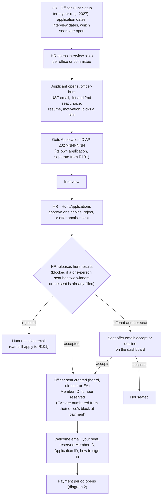
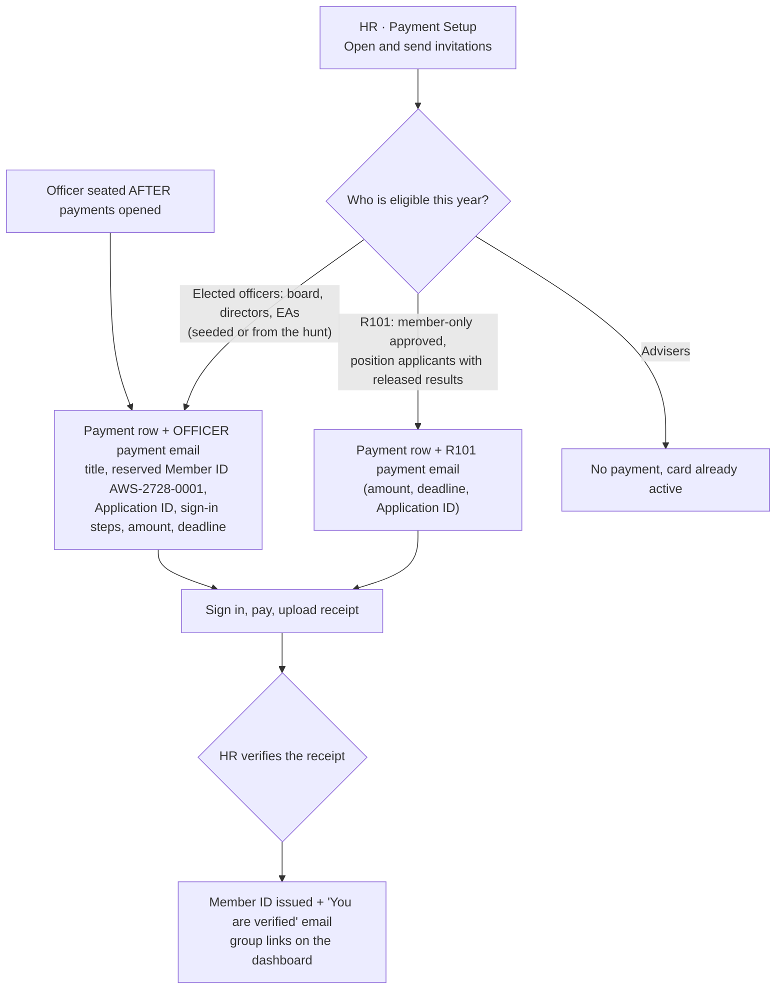
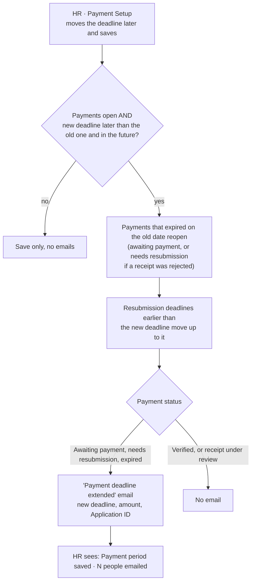
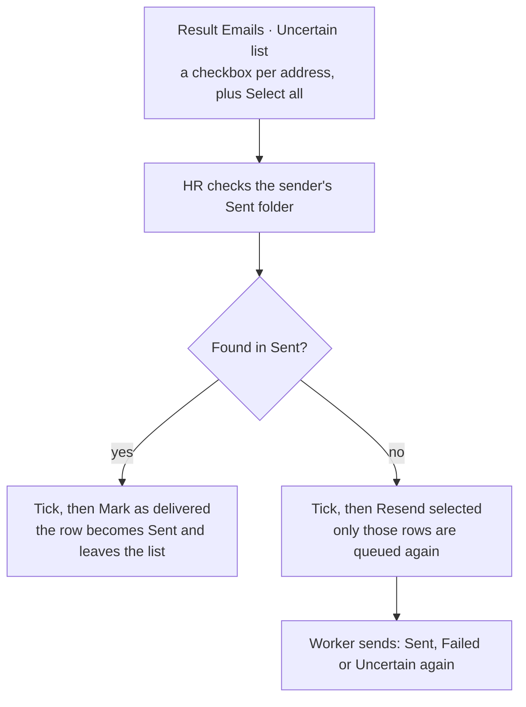

# Officer hunt, payment release, deadline extensions and email triage

How the next board, directors and executive assistants (EAs) get into the app, how one "Open payments" action invites both R101 members and officers, and what happens to emails that may or may not have been delivered.

The Officer Hunt is its own round, separate from R101. It reuses applying, interviews, decisions, redirects and results, but its applications, seats and interview slots are tagged `officer_hunt`, so the two rounds never show up in each other's lists.

## 1. Officer hunt: from applying to holding a seat

Things to know:

- The term year is the year the winners serve. Their Application IDs and Member IDs follow it (`AP-2027-…`, `AWS-2728-…`).
- A board or director seat has one holder. Two accepted applicants for the same seat, or a seat that is already filled for the term, block the release with a reason on each application.
- An EA seat takes people in numbers. Set how many places it has when you open it. The Member ID block for an office is sized by the office's R101 EA places, so keep the total there and treat hunt EAs as filling it.
- Accepting a seat offer seats the person immediately, and sends them their welcome (and payment invitation if payments are open).

## 2. Open payments: one action, two emails

A hunt winner only joins this year's campaign when their term year is this year's recruitment year. Winners for a later term wait for that term's payments to open.

## 3. Extending the payment deadline

Saving again, or saving the same later date twice, never emails the same person twice while their first email is still queued.

## 4. Uncertain result emails

The panel works the same for the officer hunt's results, scoped to the hunt.

## Where things live

| What | Where |
|---|---|
| Hunt term, dates, seats, interview slots | HR → Officer Hunt Setup |
| Hunt applications and decisions | HR → Hunt Applications |
| Release hunt results | HR → Hunt Results |
| Public apply page | `/officer-hunt` |
| Payment release and deadline | HR → Payment Setup |
| Uncertain emails | The Result Emails panel on each Results page |
