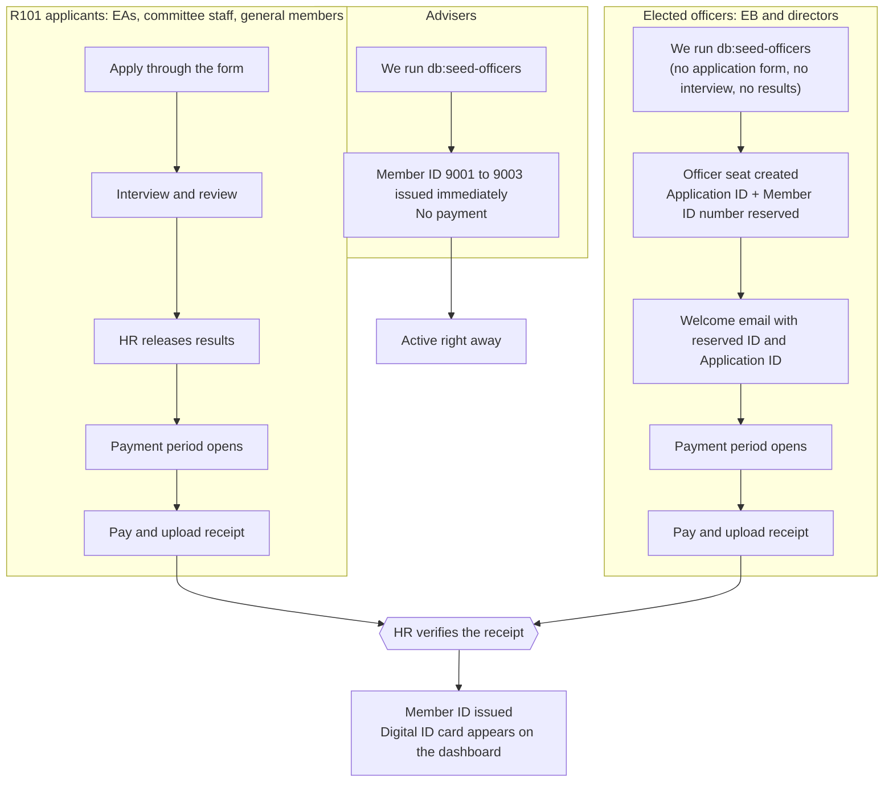
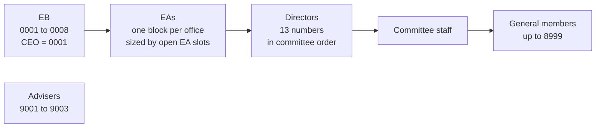

# Member ID flow: EB, directors and advisers vs. R101

The Executive Board (8) and committee directors (13) were elected before the app existed, so they never go through R101. Advisers (3) don't pay at all. EAs, committee staff and general members come from R101.

> From the next term on, the board, directors and EAs come through the **Officer Hunt**, which runs in the app. See [officer-hunt-and-payments-flow.md](officer-hunt-and-payments-flow.md). Seeding with `db:seed-officers` was the one-time way to bring in the current term.

Everyone ends up with the same kind of Member ID (`AWS-2627-NNNN`) and the same digital card. What differs is how they get in.

## 1. The two paths side by side



Officers skip the whole left column up to the payment period. From the payment period onward they use the same dashboard, QR, receipt review and card as everyone else.

## 2. What happens to an officer, step by step

```mermaid
sequenceDiagram
    autonumber
    actor Dev as Us (one-time setup)
    participant App as Backend
    actor Off as Officer (e.g. the CEO)
    actor HR as HR / Finance

    Dev->>App: db:seed-officers
    App->>App: Create officer seat + Application ID for each EB and director
    App->>Off: Welcome email: reserved ID AWS-2627-0001 + Application ID
    HR->>App: Open the payment period
    App->>Off: Payment invitation (QR, amount, deadline)
    Off->>App: Sign in with Application ID + UST email, then one-time code
    Off->>App: Save student number and section
    Off->>App: Submit receipt
    HR->>App: Verify receipt
    App->>App: Issue the seat's number (CEO is always 0001)
    App->>Off: Digital Member ID card on the dashboard
    Note over App,Off: Until verified: the number is reserved, the card is hidden,<br/>and the public QR page does not show them as active
```

## 3. How the numbers are laid out



| Block | Numbers | How it is fixed |
|---|---|---|
| Executive Board | 0001–0008 | By seat, in office order (CEO to CCO). Never changes. |
| EAs | from 0009 | First free number in their office's block when their payment is verified. |
| Directors | right after the EA block | By seat, in committee order. Never changes. |
| Committee staff | after directors | First free number when their payment is verified. |
| General members | after staff, up to 8999 | First free number when their payment is verified. |
| Advisers | 9001–9003 | Fixed, issued when seeded. |

## 4. Who sees what, and when

| Person | Has an Application ID | Pays | ID is active | Shows in HR Members as |
|---|---|---|---|---|
| EA, staff, general member | When they apply | Yes | After receipt is verified | Active member |
| EB, director | When we seed them | Yes | After receipt is verified | "Reserved AWS-2627-0001" until paid, then Active |
| Adviser | When we seed them | No | Immediately | Active member, with the Adviser filter |

## 5. Things to remember

- **Officers never appear in recruitment.** They are a separate `officer` application type that the applications list, season overview, results preview and interview tools skip.
- **Reserved is not issued.** The number is only held for the seat. Nobody else can take it, but the public QR page shows no one until the receipt is verified.
- **Open EA slots must be final first.** The directors' block starts after the EA block, which is sized by open slots. Change slots after directors pay and their numbers would not move, so set them first.
- **Old IDs are never reused.** If a verification is reversed, the ID stays with that person.
- **Advisers join no groups.** They never get the Members Facebook Group, a committee chat or the core team chat.
- **Advisers need emails.** They are seeded with placeholder emails, so they can't sign in until HR sets real ones.
